# EchoGPT Chrome Extension

EchoGPT is a Chrome side-panel extension UI built with Next.js and React. It includes Home, Chat, Write, Read, Translate, Image, Video, and More screens.

> **Status:** This is currently a UI prototype. AI responses, current-tab summarization, document analysis, and image/video generation are not connected to a backend. Some screens display placeholder results.

## Install in Chrome

1. Download `echogpt-extensions.zip` from the repository's **Releases** page.
2. Extract the ZIP. The folder selected in Chrome must contain `manifest.json` at its root.
3. Open `chrome://extensions` and enable **Developer mode**.
4. Click **Load unpacked** and select the extracted folder containing `manifest.json`.
5. Open EchoGPT from the Chrome toolbar. After downloading an updated build, click **Reload** on the extension card.

The release ZIP should contain the built extension, not the source project. When creating the ZIP, archive the contents of `out/` so `manifest.json` is at the top level.

## Build from Source

Requirements: Node.js 20.9 or newer and pnpm 12.4.2.

```bash
pnpm install --frozen-lockfile
pnpm run build
```

The extension build is generated in `out/`. To preview the UI during development:

```bash
pnpm run dev
```

Then open `http://localhost:3000`. Development mode does not reproduce all Chrome extension restrictions; test production builds in Chrome too.

## Screenshots

### Download and Setup

| Step 1 | Step 2 |
| --- | --- |
| 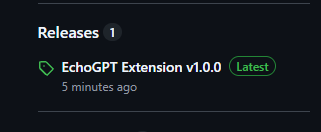 | 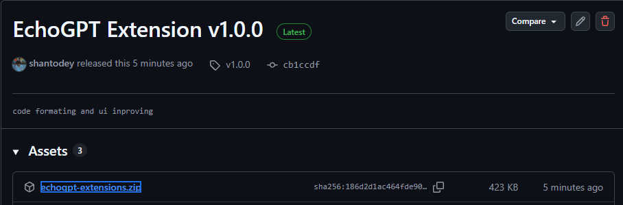 |

| Step 3 | Step 4 |
| --- | --- |
| 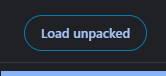 | 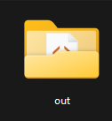 |

### Extension UI

| Home | Chat |
| --- | --- |
| 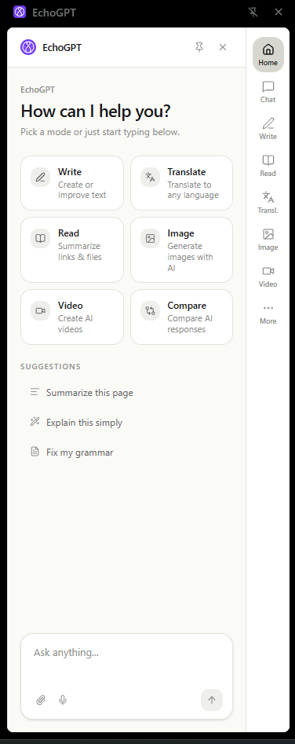 | 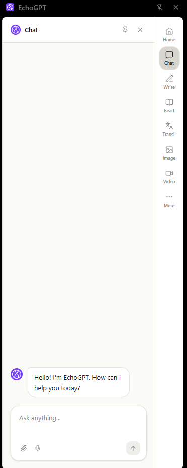 |

| Read | Write |
| --- | --- |
| 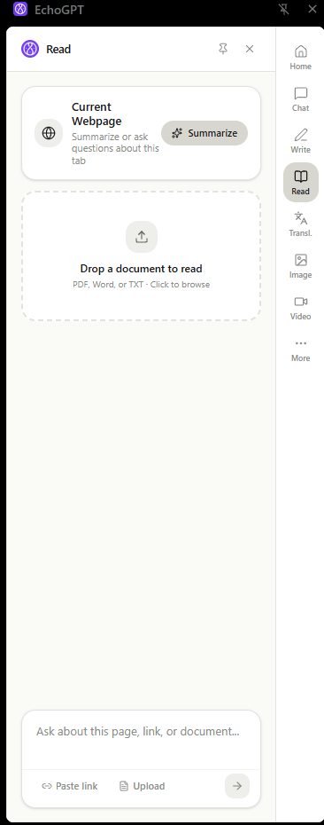 | 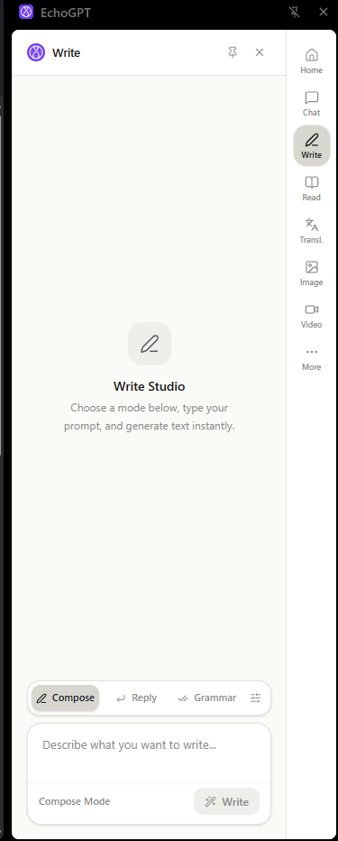 |

| Image | Video |
| --- | --- |
| 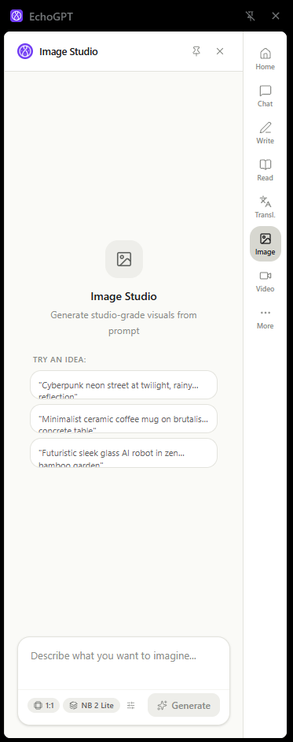 | 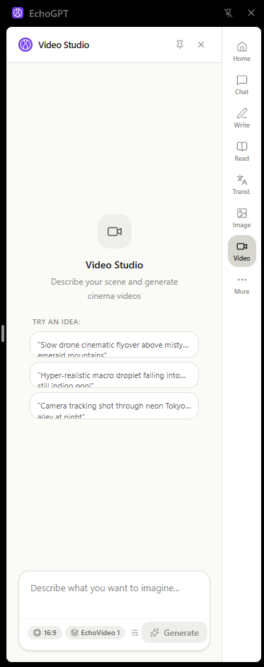 |

| Translate | More |
| --- | --- |
| 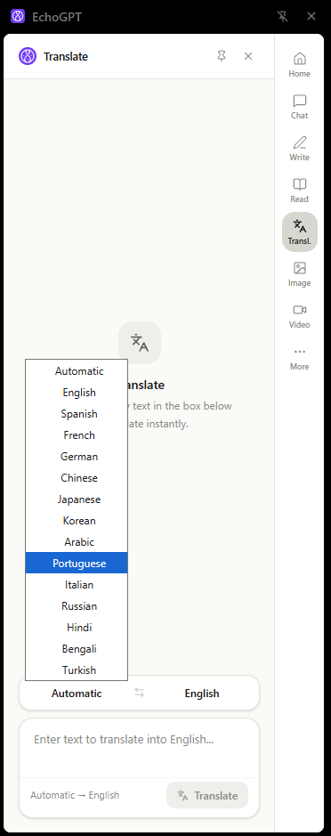 | 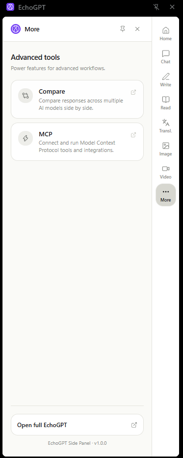 |

## Share a Build

Create a GitHub Release and attach a ZIP of the built extension. Examiners can download and load that package without installing Node.js or building the source code.
